## Real-time COVID-19 Tweet Analysis 🌐📊


Unleash the power of real-time COVID-19 Tweet analysis with this microservices ETL architecture. Built on Spring Cloud Stream and Apache Kafka, this project is your gateway to ingesting, processing, and visualizing tweets about the pandemic.

Project developed to practice what I have learned in the Udemy course [Apache Kafka Series - Learn Apache Kafka for Beginners v2](https://www.udemy.com/course/apache-kafka/).

The tech stack includes Spring Boot 2.3.2, Apache Maven 3.6.3, Spring Cloud Stream, Elasticsearch, Kibana, and more, all running as Docker containers.

Explore the project, visualize COVID-19 tweet data, and analyze sentiment and trending terms with ease. For more detailed information, check out our [Medium article](https://medium.com/@sanchezsanchezsergio418/covid-tweets-etl-architecture-be4b8d03a036).

Thank you for visiting the Covid Tweets ETL Architecture GitHub repository! Stay informed and empowered with real-time Tweet analysis. 📈🦠🔍

## ⚠️ Disclaimer

**Real-time COVID-19 Tweet Analysis** is an **educational project** designed to practice real-time data analysis by ingesting and processing public tweets related to COVID-19. This tool is **not intended for professional use or medical decision-making**.

The results and analysis provided should be considered part of a **practical learning experience** and **not as an official source of information**. Always consult reliable and official sources for public health information.

Additionally, the logo used in this project was **generated during a brainstorming session with ChatGPT** and is **free of copyright**.

## Architecture Overview

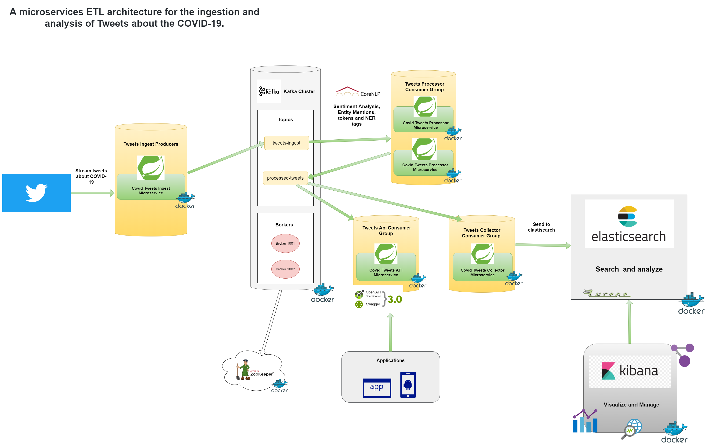

## Applications

* *covid-tweets-api*
`Spring Boot` Web Java application that allows to retrieve and view the tweets processed through a `REST API` or `STOMP over WebSocket`. 

* *covid-tweets-collector*
`Spring Boot` Web Java application that listens to news messages in `processed-tweets` topic in `Kafka`,  saves them in `Elasticsearch`. 

* *covid-tweets-ingest*
`Spring Boot` Web Java application that implement a Twitter client that receives the latest tweets about COVID-19, creates the data model associated with the tweet, and posts it to the topic `tweets-ingest`in `Kafka`.

* *covid-tweets-processor*
`Spring Boot` Web Java application that listens to news messages in `tweets-ingest` topic in `Kafka`and it make the analysis of the text through the analysis service implemented on `Standford Core NLP`.

## Used technology

* Spring Boot 2.3.2 / Apache Maven 3.6.3.
* Spring Cloud Stream (to build highly scalable event-driven applications connected with shared messaging systems)
* Spring Cloud Starter Stream Kafka.
* lombok.
* Twitter4j Stream.
* Mapstruct.
* Elasticsearch oss 7.6.2.
* Spring Boot Starter Data Elasticsearch.
* kibana oss 7.6.2.
* Spring Boot Starter Web.
* Springdoc Openapi UI.
* Spring Boot Starter Websocket.
* Stanford Corenlp.

## Running Applications as Docker containers.

### Rake Tasks

The available tasks are detailed below (rake --task)


| Task | Description |
| ------ | ------ |
| check_deployment_file_task | Check Deployment File |
| check_docker_task | Check Docker and Docker Compose Task |
| cleaning_environment_task | Cleaning Evironment Task |
| deploy | Deploys the Covid Tweets Architecture and laun... |
| login | Authenticating with existing credentials |
| start | Start Containers |
| status | Status Containers |
| stop | Stop Containers |
| undeploy | UnDeploy Covid Tweets Architecture |


To start the platform make sure you have Ruby installed, go to the root directory of the project and run the `rake deploy` task, this task will carry out a series of preliminary checks, discard images and volumes that are no longer necessary and also proceed to download all the images and the initialization of the containers.

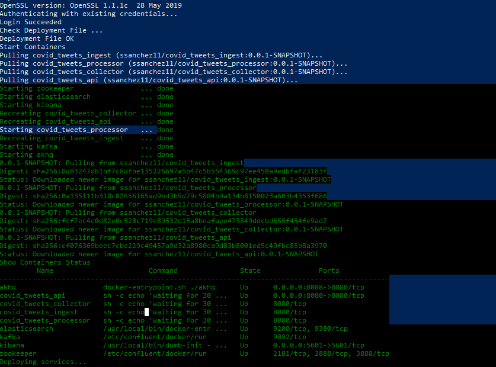


Also make sure to define your own credentials in the `twitter4j.properties` file

```
oauth.consumerKey=YOUR_CONSUMER_KEY
oauth.consumerSecret=YOUR_CONSUMER_SECRET
oauth.accessToken=YOUR_ACCESS_TOKEN
oauth.accessTokenSecret=YOUR_ACCESS_TOKEN_SECRET

```


## Some screenshots

### Deploy with Docker Compose.

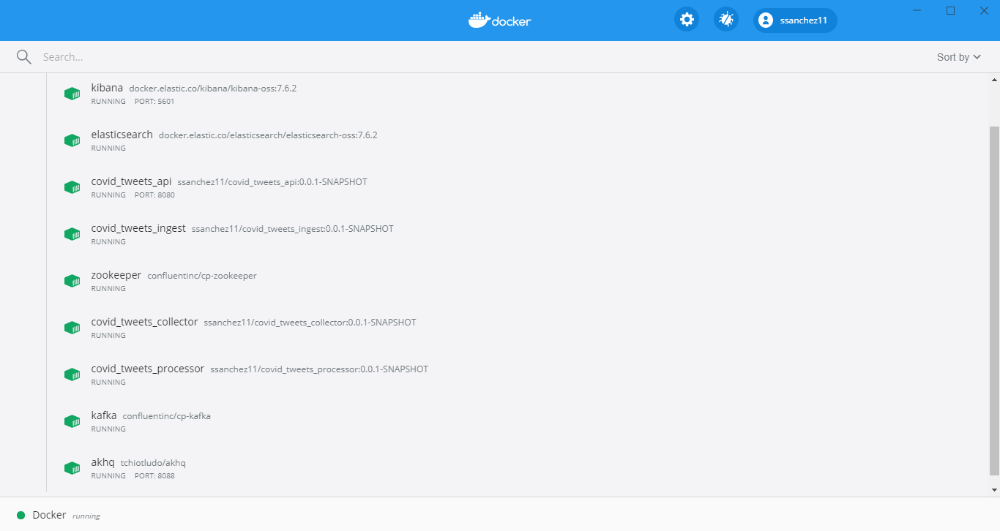

### Using Akhq dashboard for topics management and kafka broker.

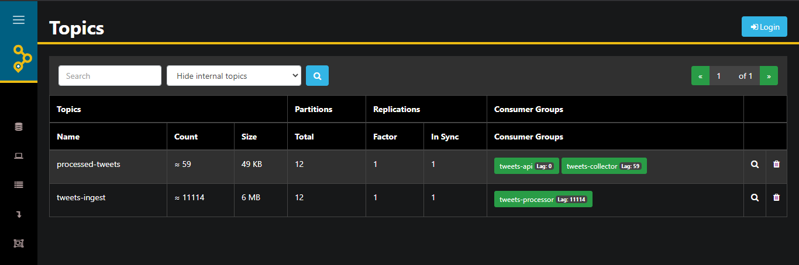

### Tweets processed will be stored to elasticsearch index and visualize with Kibana.

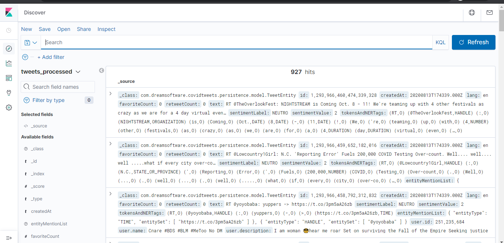

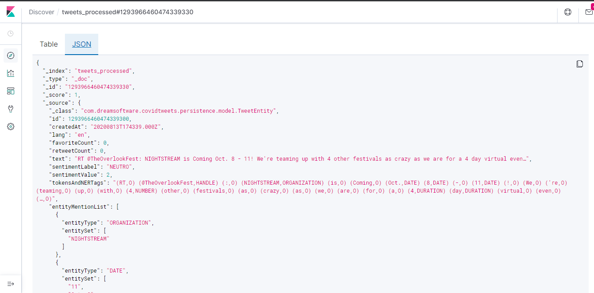

### Tweets processed can be get through the REST API / WebSockets offered from the Covid Tweets Microservice API.

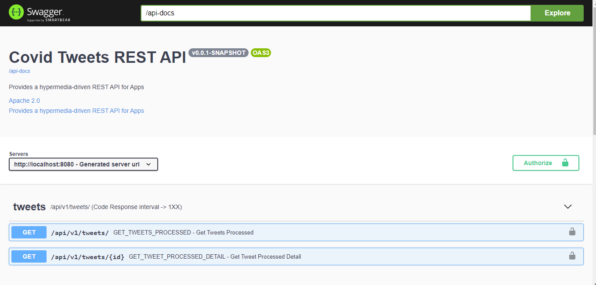

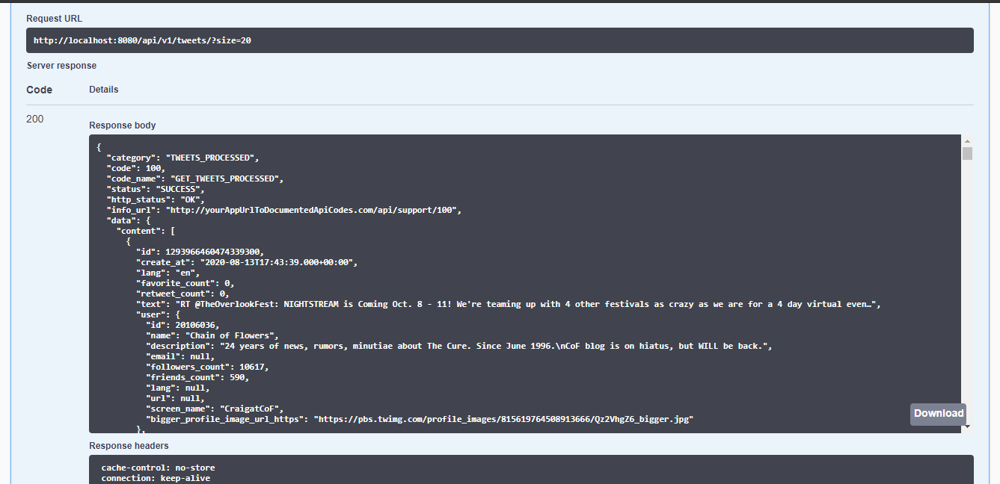

### Visualization of the general sentiment and the most frequent terms.

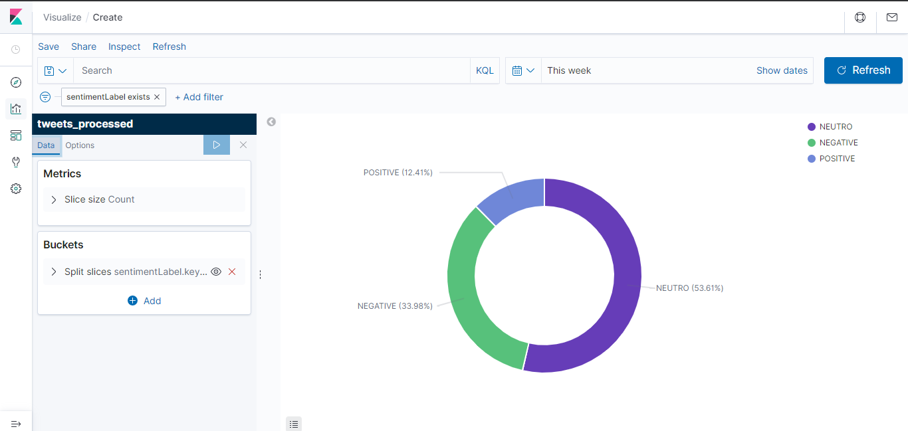
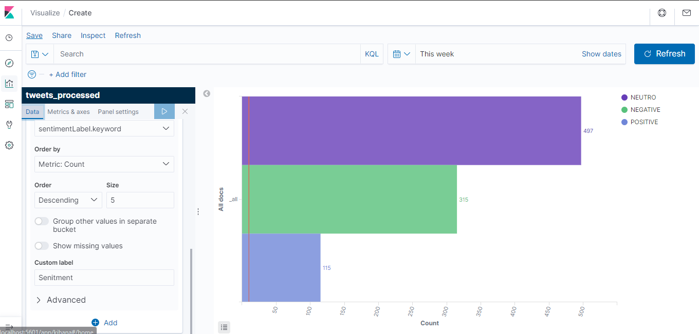
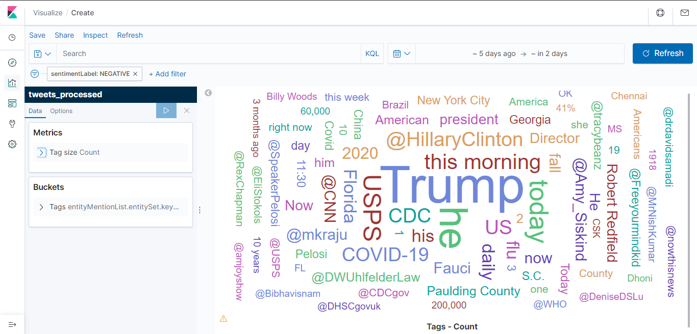
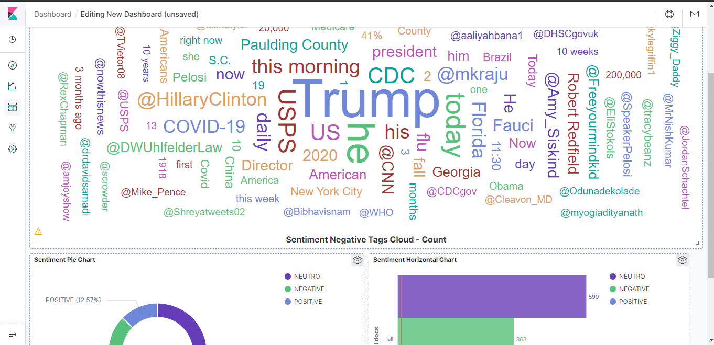

## Visitors Count


## Please Share & Star the repository to keep me motivated.
  <a href = "https://github.com/sergio11/covid_tweets_etl_architecture/stargazers">
     
  </a>
  <a href = "https://twitter.com/SergioReact418">
     
  </a>


